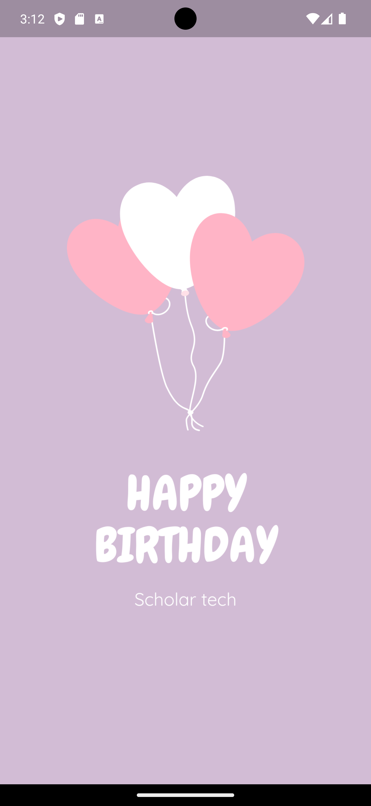

# BirthDayCard



**BirthDayCard** is a simple Flutter application that displays a birthday card image in the center of the screen. This project serves as an example of using Flutter to create a basic mobile application with a static background and image display.

## Features
- A centered birthday card image.
- A custom background color.

## Getting Started

### Prerequisites
- Flutter SDK

### Setup
1. **Clone the repository:**
   ```bash
   git clone https://github.com/yourusername/BirthDayCard.git
